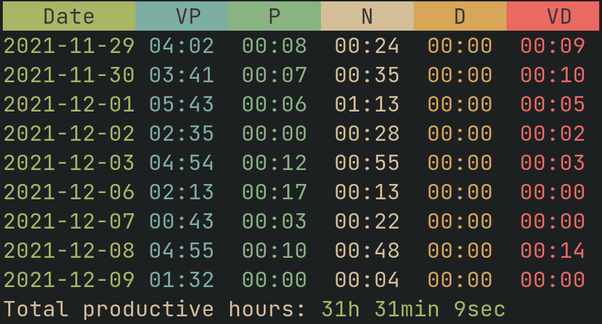

# Script to get your productive time info from RescueTime API
<p align="center">
  
</p>

## How to use

1. Get your API key from [RescueTime](https://www.rescuetime.com/anapi/manage).
   It will be good to create a new API key.
2. Save it to:
   - C:\\Users\\%username%\\.rescuetime (on Windows)
   - ~/.local/share/rescuetime.key (on Linux and Windows)
   - any other path. Pass this path as the `-k` or `--key` parameter to the script
3. Install dependencies:
   - local virtual environment:
   ```bash
   python3 -m venv .venv
   source .venv/activate
   pip install -r requirements.txt
   ```
   - user global package cache:
   ```bash
   pip install -r requirements.txt
   ```
4. Run the script:

```bash
python main.py [OPTIONS]
```

## Arguments

- `-k`, `--key` - Path to the file with user's API key
- `-f`, `--from` - Sets the start day for data batch, inclusive. (always at time 00:00, start hour/minute not supported)
- `-t`, `--to` - Sets the end day for data batch, inclusive. (always at time 00:00, start hour/minute not supported)
- `-w`, `--wage` - The number of money earned by hour from productive time
- `--multiplier` - Additional multiplier for productive time

### Legacy `How To`

I renamed the old script to `__legacy.py`, so you could use it.

1. Get your API key from [RescueTime](https://www.rescuetime.com/anapi/manage).
   It will be good to create a new API key.
2. Save it to:
   - C:\\Users\\%username%\\.rescuetime (on Windows)
   - ~/.local/share/rescuetime.key (on Linux and Windows)
   - any other path. Pass this path as the `-k` parameter to the script
3. Install dependencies via pip:

```bash
pip install --user colorama requests
```

4. Run the script

## Examples

```bash
python source.py -k "C:\path\to\api\key.txt"
```
